# AQUA+

AQUA+ is an immersive ocean-tech museum web application designed to inspire curiosity, innovation and marine conservation.

The application combines interactive marine exhibits, a 360° virtual museum experience and personalised exhibit collections.

Developed as a Software Engineering Capstone Project for the University of Canterbury / Institute of Data.

---

## Live Application

**Production application:**  
[http://aquaplus-prod-env.eba-vjytcziq.ap-southeast-6.elasticbeanstalk.com/]

> The current capstone deployment is hosted on AWS Elastic Beanstalk.

---

## Preview

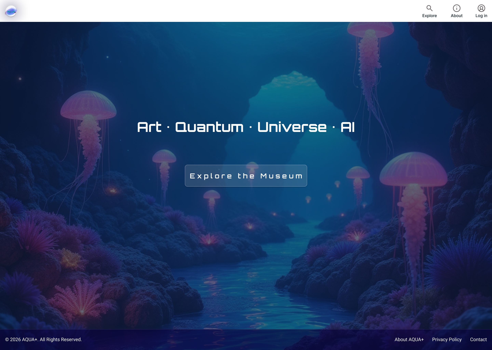

AQUA+ uses a futuristic underwater visual identity with responsive layouts, immersive imagery and glass-style interface components.

---

## Key Features

### Museum Experience

- Responsive Home page
- Explore page
- 360° virtual museum experience
- Conventional exhibit browsing
- Marine exhibit cards
- Individual Exhibit Details pages
- Desktop and mobile responsive layouts
- About page

### User Accounts

Visitors can:

- create an account;
- log in and log out;
- remain authenticated using server-side sessions;
- optionally use **Remember me** for a persistent login session.

### My Collection

Authenticated users can:

- save exhibits;
- add an optional personal note;
- view saved exhibits;
- edit personal notes;
- remove exhibits from their collection.

The collection functionality demonstrates full database CRUD operations:

| CRUD   | AQUA+ functionality                   |
| ------ | ------------------------------------- |
| Create | Save an exhibit / add a personal note |
| Read   | Retrieve a user's saved exhibits      |
| Update | Edit a saved personal note            |
| Delete | Remove an exhibit from My Collection  |

---

## Technology Stack

### Frontend

- React
- Vite
- React Router
- JavaScript
- Custom CSS
- Lucide React

### Backend

- Node.js
- Express
- Sequelize ORM
- Express Session
- connect-session-sequelize

### Database

- MySQL
- Amazon RDS for MySQL in production

### Testing

- Jest
- Postman
- Browser/manual testing
- Lighthouse accessibility/performance review

### DevOps & Deployment

- Docker
- Git
- GitHub
- GitHub Actions
- AWS Elastic Beanstalk
- Amazon RDS
- AWS Secrets Manager
- AWS IAM

### Design & Planning

- Figma
- GitHub Projects
- VS Code

---

## Architecture Diagram

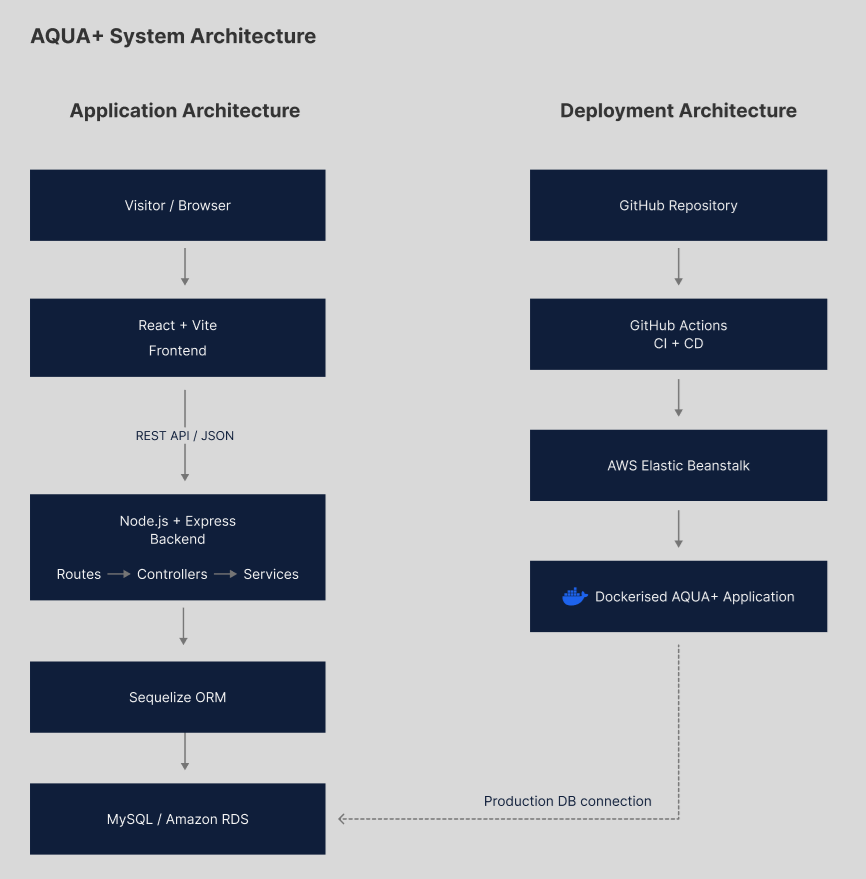

---

## Getting Started

### Requirements

Install:

- Node.js
- npm
- MySQL
- Git

---

### 1. Clone the repository

```bash
git clone https://github.com/Shenene/aquaplus.git
cd aquaplus
```

---

### 2. Create the database

Create a MySQL database named:

```text
aquaplus_db
```

---

### 3. Install the backend

Open a terminal in the `backend` folder:

```bash
cd backend
npm install
```

Create a `.env` file using `.env.example` as the reference.

Enter your own local database connection details.

---

### 4. Start the backend

From the `backend` folder:

```bash
npm run dev
```

The backend runs locally on:

```text
http://localhost:3000
```

---

### 5. Seed the exhibits

In another terminal inside `backend`, run:

```bash
npm run seed
```

This populates the database with the AQUA+ marine exhibit data.

Expected result:

```text
AQUA+ exhibit data seeded successfully
```

---

### 6. Install the frontend

From the project root:

```bash
cd frontend
npm install
```

---

### 7. Start the frontend

```bash
npm run dev
```

Open the local address displayed by Vite in the terminal.

This is usually:

```text
http://localhost:5173/
```

Run the backend in a separate terminal at the same time.

---

## Environment Variables

Create:

```text
backend/.env
```

Use:

```text
backend/.env.example
```

as the reference.

The application uses environment variables for values such as:

```text
DB_HOST=
DB_PORT=3306
DB_NAME=aquaplus_db
DB_USER=
DB_PASSWORD=

PORT=3000

SESSION_SECRET=
SESSION_COOKIE_SECURE=false
```

Production secrets are managed separately through AWS.

---

## Health Check

With the backend running:

```text
http://localhost:3000/api/health
```

---

## Public API

AQUA+ provides public read-only REST API endpoints for retrieving marine exhibit information.

| Method | Endpoint              | Description                            |
| ------ | --------------------- | -------------------------------------- |
| `GET`  | `/api/health`         | Check that the backend is running      |
| `GET`  | `/api/exhibits`       | Retrieve all marine exhibits           |
| `GET`  | `/api/exhibits/:slug` | Retrieve an exhibit by its unique slug |

### Example

```text
http://localhost:3000/api/exhibits/green-sea-turtle
```

An exhibit that does not exist returns HTTP `404` with:

```text
Exhibit not found
```

### Example exhibit data

```json
{
  "slug": "green-sea-turtle",
  "name": "Green Sea Turtle",
  "category": "Marine Reptile",
  "summary": "A graceful marine reptile that helps maintain healthy seagrass ecosystems.",
  "habitat": "Tropical & subtropical oceans, seagrass beds",
  "diet": "Seagrass, algae, marine plants",
  "lifespan": "50-70 years",
  "conservationStatus": "Least concern"
}
```

---

## Authentication

AQUA+ uses server-side session authentication.

The authentication system supports:

- account registration;
- login;
- logout;
- current-user session checking;
- Remember me;
- validation feedback;
- protected My Collection functionality.

Passwords are stored securely as hashes rather than as plain-text passwords.

Session information is stored using a Sequelize-backed session store.

---

## Testing

Testing was completed throughout development using automated and manual methods.

### Jest

Backend automated tests cover core API, authentication middleware and collection functionality.

Test files include:

```text
backend/tests/
├── api.test.js
├── authMiddleware.test.js
└── collectionController.test.js
```

Run the backend test suite from `backend`:

```bash
npm test
```

### Postman

Postman was used to test:

- health endpoint;
- exhibit endpoints;
- registration;
- login;
- logout;
- current authenticated user;
- valid and invalid authentication;
- Remember me behaviour;
- collection functionality;
- duplicate and error cases.

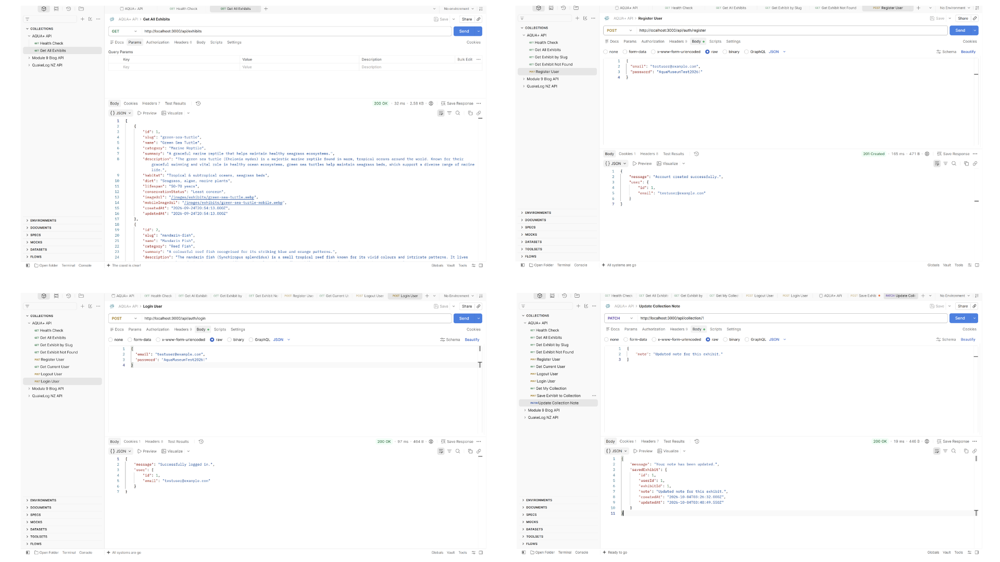

### Frontend verification

Before merging frontend changes:

```bash
npm run lint
npm run build
```

### Production testing

The deployed application was also manually tested for:

- page navigation;
- exhibit loading;
- registration and login;
- session authentication;
- saving exhibits;
- editing notes;
- removing exhibits;
- responsive behaviour.

---

## CI/CD & Deployment

AQUA+ is containerised using Docker and deployed to AWS.

### Continuous Integration

GitHub Actions CI checks application changes before they are merged.

Frontend checks include:

```bash
npm run lint
npm run build
```

Backend testing includes:

```bash
npm test
```

### Continuous Deployment

The deployment workflow uses GitHub Actions to deploy the application to AWS Elastic Beanstalk.

Production infrastructure includes:

- AWS Elastic Beanstalk
- Docker
- Amazon RDS MySQL
- AWS Secrets Manager
- AWS IAM

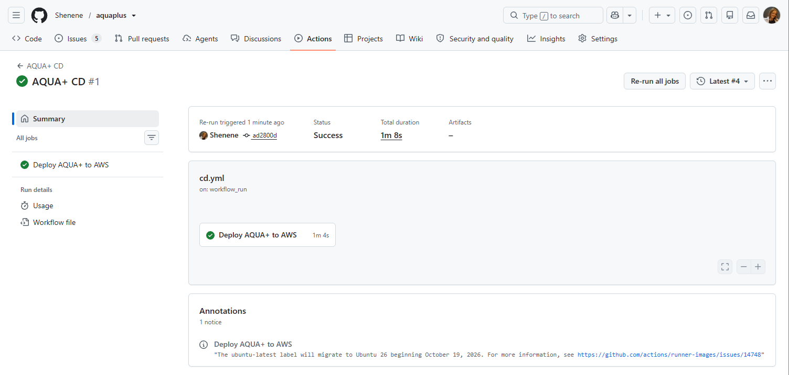

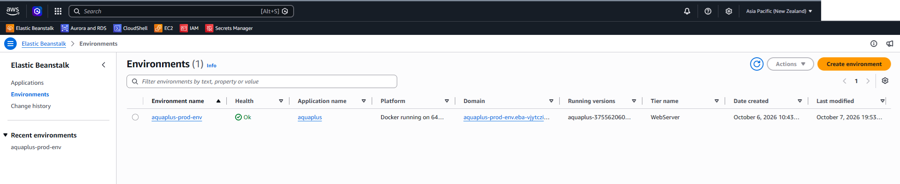

---

## Project Structure


AQUA+ is organised into a clear full-stack structure with separate frontend and backend folders.

- `.github/workflows/` contains CI/CD workflows for GitHub Actions.
- `backend/` contains the Express API, Sequelize models, controllers, services, routes, middleware, tests, and seed data.
- `frontend/` contains the React + Vite application, including reusable components, pages, authentication context, and public assets.
- `Dockerfile` defines the production container build.
- `README.md` provides project documentation.

---

## UX & Design

The AQUA+ interface was designed in Figma before implementation.

The UX planning includes:

- project brief;
- problem statement;
- target users and stakeholders;
- proto persona;
- user stories;
- acceptance criteria;
- empathy map;
- user journey;
- information architecture;
- authentication flow;
- main visitor flow;
- navigation flows;
- wireframes;
- desktop high-fidelity designs;
- mobile high-fidelity designs.

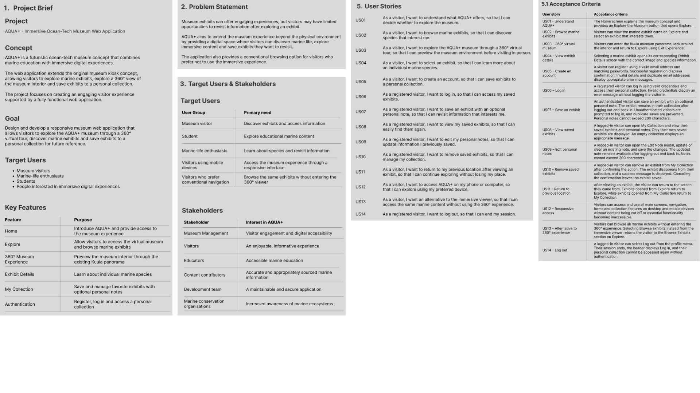

## Wireframes

Early wireframes were created in Figma to plan the structure and layout of the main AQUA+ screens across desktop and mobile.

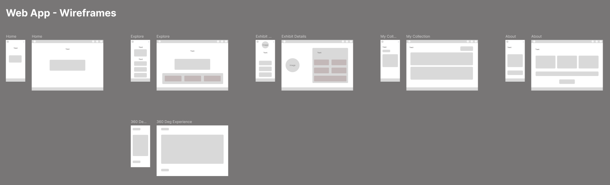

### Design System

AQUA+ uses:

- **Orbitron** — major headings
- **Exo 2** — buttons and controls
- **Roboto** — body text

The visual system combines underwater imagery, aqua and purple accents, and glass-style interface panels.

---

## Git & Project Workflow

Development uses Git and GitHub with feature/fix branches rather than working directly on `main`.

Typical workflow:

```text
main
  ↓
feature / fix branch
  ↓
development
  ↓
testing
  ↓
commit
  ↓
push
  ↓
Pull Request
  ↓
CI checks
  ↓
merge to main
```

GitHub Projects is used for:

- Todo;
- In Progress;
- Done;
- project roadmap;
- development milestones;
- deployment;
- testing;
- documentation;
- final release preparation.

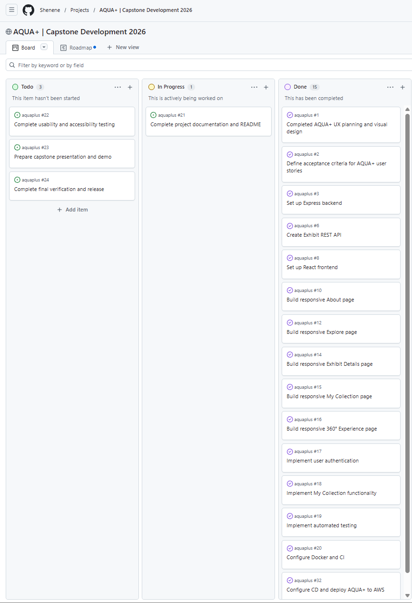

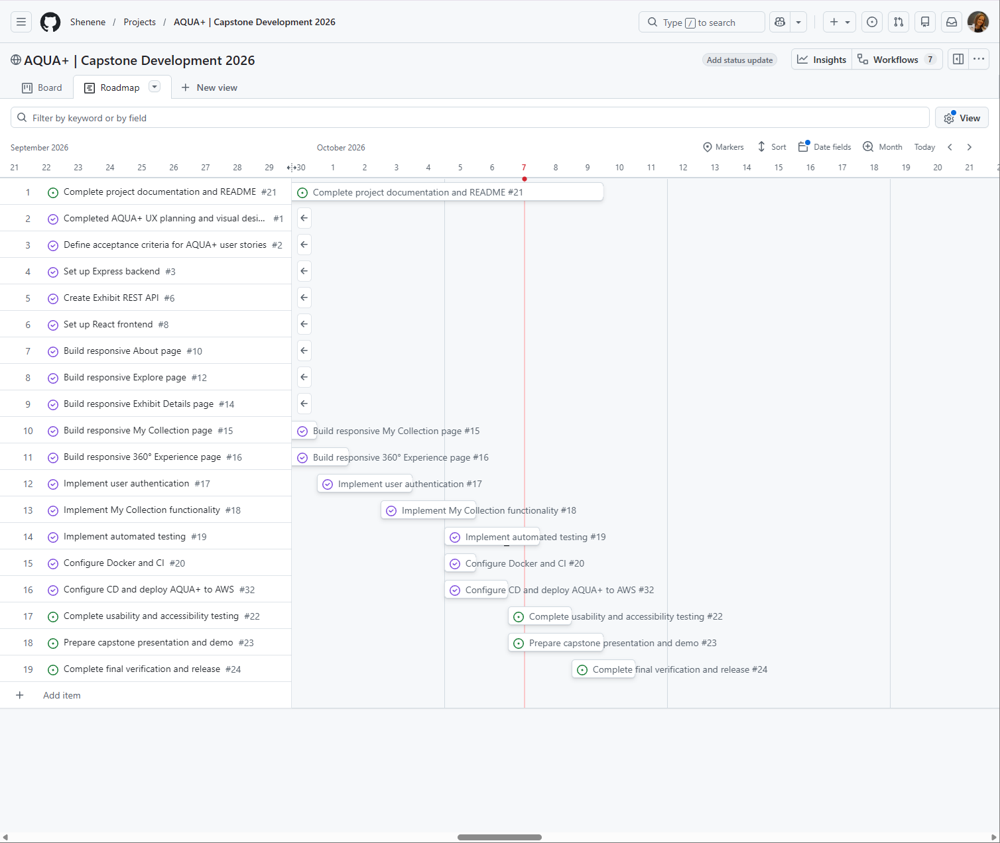

---

## Current Scope & Future Development

The capstone focuses on delivering a working end-to-end MVP.

Future enhancements include:

- HTTPS/TLS and production security hardening;
- custom domain;
- expanded exhibit catalogue;
- completed Privacy Policy;
- completed Contact information;
- password-reset functionality;
- additional usability testing;
- SUS, SEQ and CES usability evaluation;
- expanded automated testing;
- further monitoring and analytics;
- richer 360° interactions;
- additional AR/VR experiences.

---

## Screenshots

### Explore

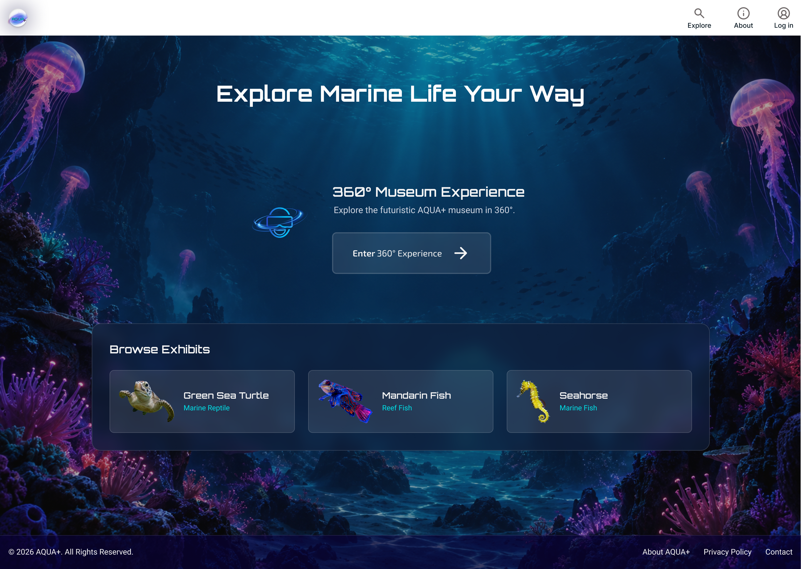

### Exhibit Details

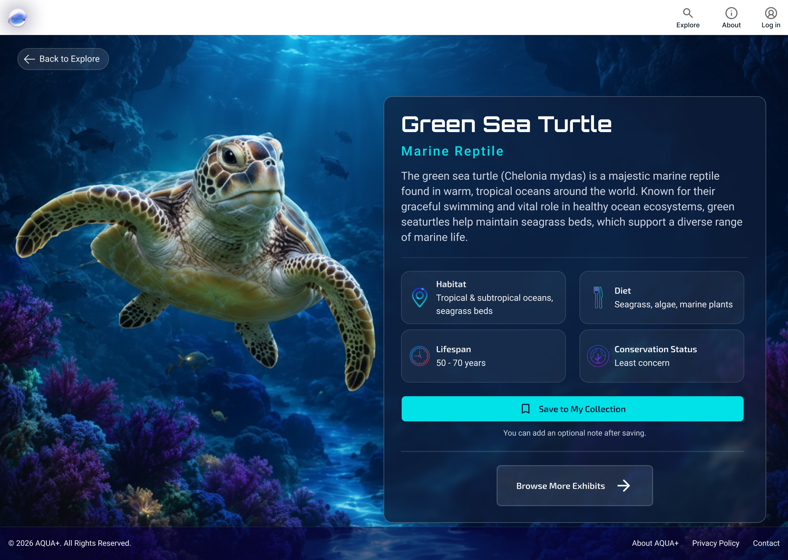

### My Collection

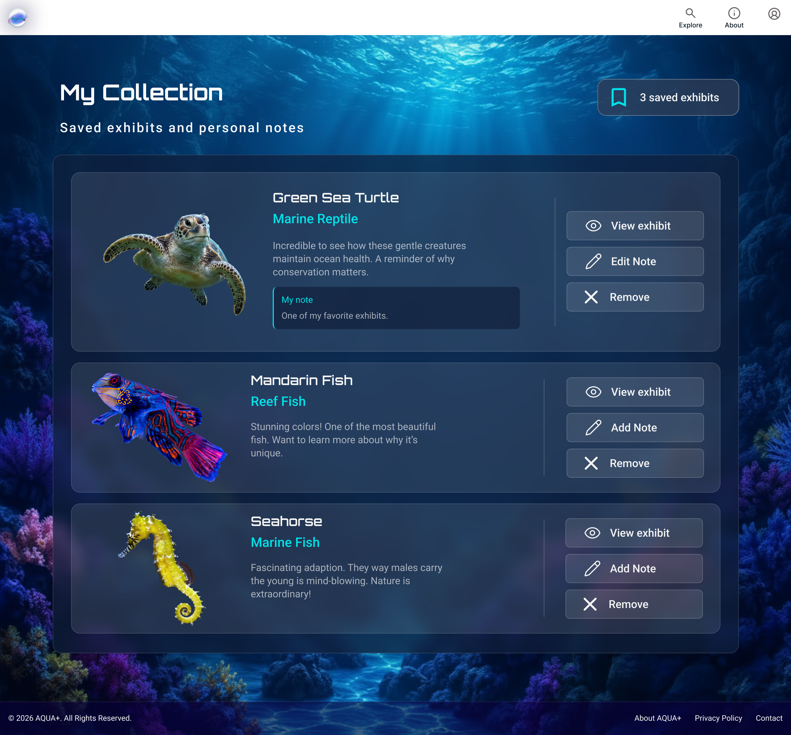

### Responsive Design

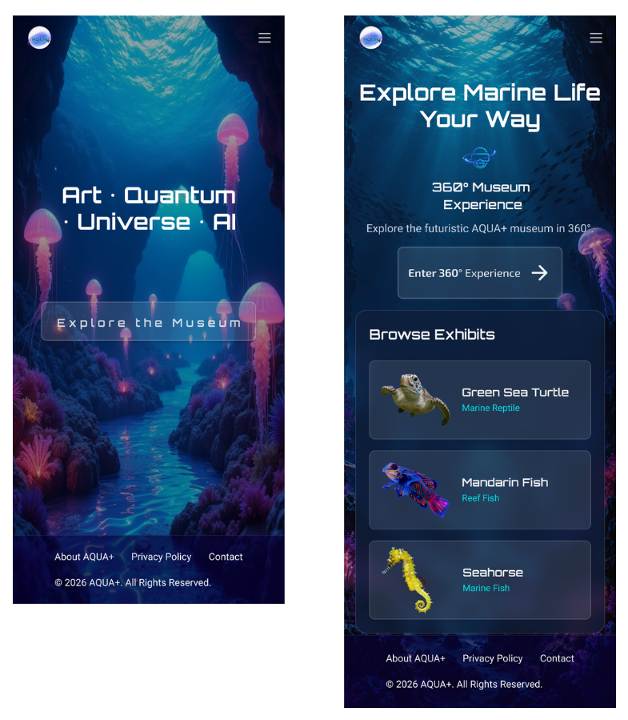

---

## Author

**Shenene Carstens**

Software Engineering Capstone Project  
University of Canterbury / Institute of Data  
2026

GitHub: [Shenene](https://github.com/Shenene)

---

## Project Status

AQUA+ capstone MVP is deployed and operational.

Completed core functionality includes:

- responsive React frontend;
- Express REST API;
- public exhibit API;
- MySQL database;
- user registration;
- session authentication;
- Remember me;
- My Collection CRUD functionality;
- Jest automated tests;
- Postman API testing;
- Docker;
- CI/CD;
- AWS Elastic Beanstalk deployment;
- Amazon RDS production database.
